# Clinical NLP Project — Full Implementation Plan (A to Z)

> **Branch**: `ahmed-adel-tasks` | **Date**: 2026-06-23
> **Team**: AI/ML Group (DEPI Program)

---

## Table of Contents

**Part A — Clinical NLP Pipeline**
1. [Project Overview](#1-project-overview)
2. [System Architecture (High-Level)](#2-system-architecture-high-level)
3. [NLP Pipeline Architecture](#3-nlp-pipeline-architecture)
4. [NLP Model Architecture Diagrams](#4-nlp-model-architecture-diagrams)
5. [NLP Data Flow](#5-nlp-data-flow)
6. [Repository Structure](#6-repository-structure)
7. [NLP Phase-by-Phase Plan](#7-nlp-phase-by-phase-plan)

**Part B — Medical Image Diagnosis (Chest X-ray)**
8. [Image Diagnosis Overview](#8-image-diagnosis-overview)
9. [Image Pipeline Architecture](#9-image-pipeline-architecture)
10. [Image Model Architecture Diagrams](#10-image-model-architecture-diagrams)
11. [Image Data Flow](#11-image-data-flow)
12. [Image Phase-by-Phase Plan](#12-image-phase-by-phase-plan)

**Part C — Shared Infrastructure**
13. [Evaluation Strategy](#13-evaluation-strategy)
14. [Deployment Architecture](#14-deployment-architecture)
15. [Team Responsibilities](#15-team-responsibilities)

---

## 1. Project Overview

### What We Are Building

An AI-powered **clinical decision-support system** that:

| Sub-Task | Input | Output | Model |
|---|---|---|---|
| **NER** | Raw clinical note | Tagged entities (Disease / Drug / Symptom / Lab) | BioBERT + BiLSTM + CRF |
| **ICD-10 Classification** | Clinical note | Top-3 ICD-10 codes + confidence | CNN + Word2Vec |
| **Summarization** | Discharge note | Chief complaint, findings, plan | Extractive summary |
| **Gradio UI** | Clinical note text | Visual entity highlights + predictions | Gradio interface |

### Key Decisions

- **Primary NER model**: BioBERT + BiLSTM + CRF (F1: ~87–94%)
- **Secondary Classifier**: CNN + Word2Vec (F1: up to 0.98 ICD dept.)
- **Embeddings compared**: BioBERT (contextual) vs GloVe/Word2Vec (static)
- **Deployment**: Gradio demo + FastAPI bridge → .NET ClinicAI backend

---

## 2. System Architecture (High-Level)

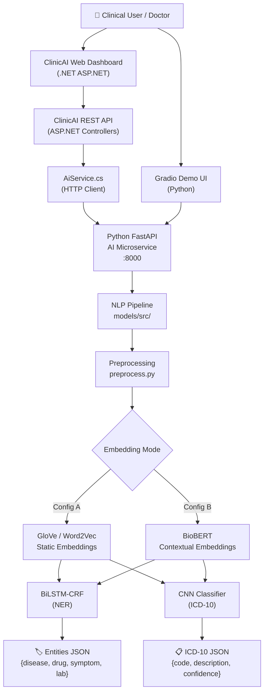

---

## 3. NLP Pipeline Architecture

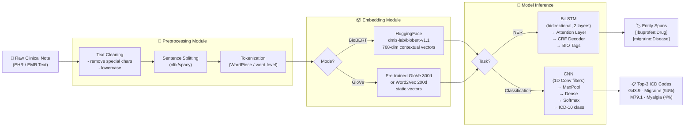

---

## 4. Model Architecture Diagrams

### 4A. BioBERT + BiLSTM + CRF (NER Model)

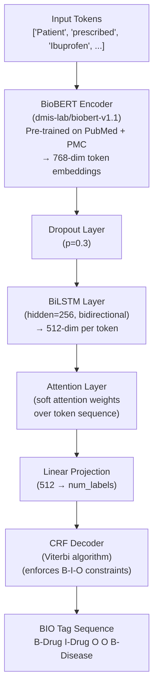

### 4B. CNN + Word2Vec (ICD-10 Classifier)

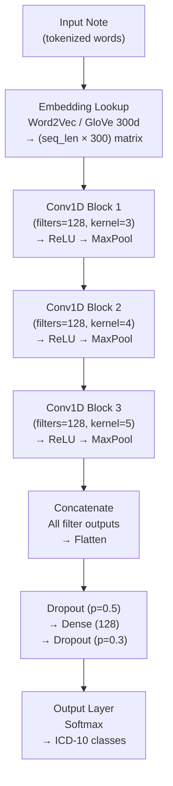

### 4C. Two-Config Experimental Comparison

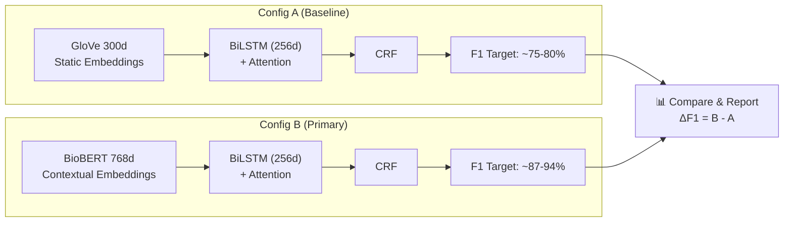

---

## 5. Data Flow

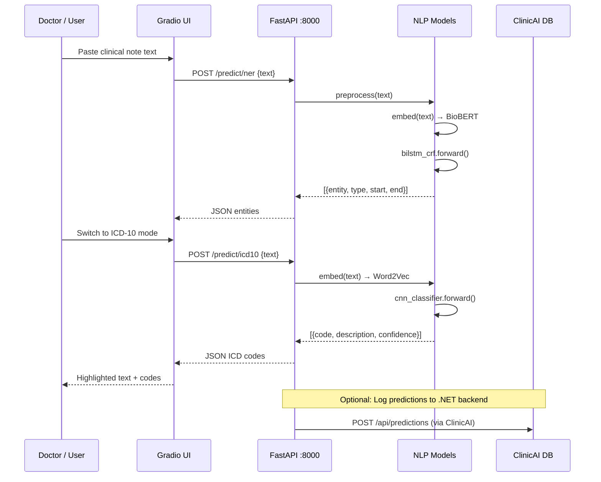

---

## 6. Repository Structure

```text
DEPI-AI-ML-Project/
│
├── README.md                          # Project overview for everyone
├── plan.md                            # Literature review & model comparison
├── GEMINI.md                          # AI assistant instructions
│
├── docs/                              # 📁 Project documentation
│   ├── FULL_PLAN.md                   # ← This file
│   ├── Clinical Note + Medical Image Diagnosis Support.docx
│   └── تعريف المشكلة وتحديد الأمراض المستهدفة.docx
│
├── models/                            # 📁 All Python AI/ML code
│   ├── clinical_nlp_workspace.py      # Quick demo / playground
│   ├── requirements.txt               # Python deps (torch, transformers, gradio…)
│   ├── app.py                         # Gradio UI launcher
│   ├── train_ner.py                   # NER training script (Config A & B)
│   ├── train_classifier.py            # ICD-10 CNN training script
│   ├── evaluate.py                    # Evaluation report generator
│   │
│   ├── data/                          # 📁 Dataset utilities
│   │   ├── download_bc5cdr.py         # Download BC5CDR NER dataset
│   │   └── explore_dataset.ipynb      # EDA notebook
│   │
│   ├── src/                           # 📁 Core pipeline modules
│   │   ├── preprocess.py              # Text cleaning + tokenization
│   │   ├── embeddings.py              # BioBERT & GloVe loaders
│   │   ├── models.py                  # BiLSTM-CRF + CNN model classes
│   │   └── crf.py                     # CRF layer (Viterbi decoder)
│   │
│   ├── api/                           # 📁 FastAPI microservice
│   │   ├── main.py                    # /predict/ner, /predict/icd10 endpoints
│   │   └── schemas.py                 # Pydantic request/response models
│   │
│   ├── checkpoints/                   # 📁 Saved model weights (.pt files)
│   └── tests/                         # 📁 Unit tests
│       ├── test_preprocess.py
│       └── test_models.py
│
├── Web/                               # 📁 .NET ClinicAI backend
│   └── ClinicAI/
│       ├── Services/AiService.cs      # Calls Python FastAPI from .NET
│       ├── Controllers/               # REST API controllers
│       ├── Models/                    # EF Core data models
│       └── ...                        # Full ASP.NET project
│
└── specs/                             # 📁 Spec-Driven Development docs
    └── 001-clinical-nlp-pipeline/
        ├── spec.md
        ├── plan.md
        ├── tasks.md
        └── checklists/requirements.md
```

---

## 7. Phase-by-Phase Plan

### ✅ Phase 0 — Setup (Done)

- [x] Create `ahmed-adel-tasks` branch
- [x] Initialize Spec Kit (constitution, spec, tasks)
- [x] Create `models/` directory with workspace file
- [x] Update `README.md` with project description

---

### 🔲 Phase 1 — Data Collection & Exploration

**Goal**: Get the training data ready for NER and classification.

| Step | Action | File |
|---|---|---|
| 1.1 | Download BC5CDR dataset (chemical/disease NER) | `models/data/download_bc5cdr.py` |
| 1.2 | Download NCBI-disease dataset (alternative NER) | `models/data/download_bc5cdr.py` |
| 1.3 | Perform EDA: label distribution, sentence lengths, entity frequencies | `models/data/explore_dataset.ipynb` |
| 1.4 | Register for MIMIC-III/IV on PhysioNet (for ICD data) | External |

**Datasets**:

| Dataset | Task | Source | Access |
|---|---|---|---|
| BC5CDR | NER (chemical + disease) | PubMed Central | Public |
| NCBI-disease | NER (disease only) | NCBI | Public |
| MIMIC-III | NER + ICD-10 coding | PhysioNet | Credentialed |
| GloVe 6B / 840B | Static embeddings | Stanford NLP | Public |
| BioBERT v1.1 | Contextual embeddings | HuggingFace Hub | Public |

---

### 🔲 Phase 2 — Preprocessing

**Goal**: Convert raw text into model-ready tensors with correct BIO labels.

```text
Raw text → Clean → Sentence split → Tokenize → Align BIO labels → Batch
```

| Step | Action | File |
|---|---|---|
| 2.1 | Text cleaning (lowercase, remove special chars, expand abbreviations) | `models/src/preprocess.py` |
| 2.2 | Sentence tokenization using `nltk.sent_tokenize` | `models/src/preprocess.py` |
| 2.3 | BIO label alignment with subword tokenization (for BioBERT) | `models/src/preprocess.py` |
| 2.4 | Create `DataLoader` batches with padding and masking | `models/src/preprocess.py` |
| 2.5 | Write unit tests | `models/tests/test_preprocess.py` |

---

### 🔲 Phase 3 — Embeddings

**Goal**: Build both embedding configurations.

| Config | Library | Model | Dimension |
|---|---|---|---|
| **A (Baseline)** | `gensim` / `numpy` | GloVe 6B.300d or Word2Vec | 300 |
| **B (Primary)** | `transformers` | `dmis-lab/biobert-v1.1` | 768 |

Files: `models/src/embeddings.py`

---

### 🔲 Phase 4 — Model Implementation

**Goal**: Build the two model classes.

| Model | Architecture | File |
|---|---|---|
| `BiLSTM_CRF` | BioBERT/GloVe → BiLSTM (256d) → Attention → CRF | `models/src/models.py` + `models/src/crf.py` |
| `CNNClassifier` | Word2Vec → Conv1D (3 sizes) → MaxPool → Dense → Softmax | `models/src/models.py` |

---

### 🔲 Phase 5 — Training

**Goal**: Train both configurations and log results.

```bash
# Config A: GloVe + BiLSTM + CRF
uv run python models/train_ner.py --embedding glove --epochs 20

# Config B: BioBERT + BiLSTM + CRF
uv run python models/train_ner.py --embedding biobert --epochs 10

# ICD-10 classifier
uv run python models/train_classifier.py --epochs 15
```

Files: `models/train_ner.py`, `models/train_classifier.py`

**Hyperparameters**:

| Parameter | NER | Classifier |
|---|---|---|
| Learning Rate | 2e-5 (BioBERT) / 1e-3 (GloVe) | 1e-3 |
| Batch Size | 16 | 32 |
| Hidden Dim | 256 | — |
| Dropout | 0.3 | 0.5 |
| Optimizer | AdamW | Adam |

---

### 🔲 Phase 6 — Evaluation

**Goal**: Generate a comparison report — Config A vs Config B.

```bash
uv run python models/evaluate.py --output docs/evaluation_report.md
```

**Metrics tracked**:

| Metric | NER | ICD Classifier |
|---|---|---|
| Entity-level F1 | ✅ | — |
| Token-level F1 | ✅ | — |
| Precision | ✅ | ✅ |
| Recall | ✅ | ✅ |
| Accuracy | — | ✅ |

---

### 🔲 Phase 7 — FastAPI Microservice

**Goal**: Wrap models in a REST API callable from the .NET backend.

```python
# POST /predict/ner
# Input:  { "text": "Patient prescribed Ibuprofen..." }
# Output: { "entities": [{ "entity": "Ibuprofen", "type": "Drug", "start": 19 }] }

# POST /predict/icd10
# Input:  { "text": "Chest pain, shortness of breath..." }
# Output: { "predictions": [{ "code": "I21.9", "label": "Acute MI", "confidence": 0.87 }] }
```

Files: `models/api/main.py`, `models/api/schemas.py`

---

### 🔲 Phase 8 — Gradio UI

**Goal**: Interactive demo for clinical staff and project demonstrations.

```text
┌─────────────────────────────────────────────────────────┐
│  Clinical NLP Demo                                       │
│  ─────────────────────────────────────────────────────  │
│  Mode: [● NER]  [○ ICD-10]                              │
│                                                          │
│  Clinical Note:                                          │
│  ┌─────────────────────────────────────────────────┐   │
│  │ Patient prescribed Ibuprofen for severe migraine │   │
│  └─────────────────────────────────────────────────┘   │
│                         [Analyze]                        │
│                                                          │
│  Results:                                                │
│  Patient prescribed [Ibuprofen: Drug] for severe        │
│  [migraine: Disease]                                     │
│                                                          │
│  Top Diagnosis: G43.9 — Migraine (94% confidence)       │
└─────────────────────────────────────────────────────────┘
```

File: `models/app.py`

---

### 🔲 Phase 9 — .NET Backend Integration

**Goal**: `AiService.cs` calls Python FastAPI and surfaces predictions.

```csharp
// Web/ClinicAI/Services/AiService.cs
public async Task<NerResult> AnalyzeNoteAsync(string clinicalNote)
{
    var payload = new { text = clinicalNote };
    var response = await _httpClient.PostAsJsonAsync("http://localhost:8000/predict/ner", payload);
    return await response.Content.ReadFromJsonAsync<NerResult>();
}
```

---

### 🔲 Phase 10 — Documentation & Final Report

- Update `docs/FULL_PLAN.md` with evaluation results
- Create `docs/evaluation_report.md` with Config A vs B comparison table
- Update `specs/001-clinical-nlp-pipeline/tasks.md` to mark all phases complete
- Push to GitHub and open a Pull Request from `ahmed-adel-tasks` → `main`

---

## 8. Evaluation Strategy

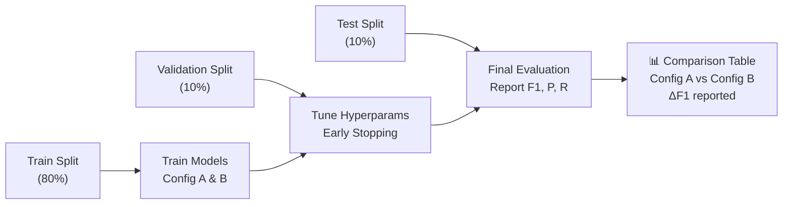

---

## 9. Deployment Architecture

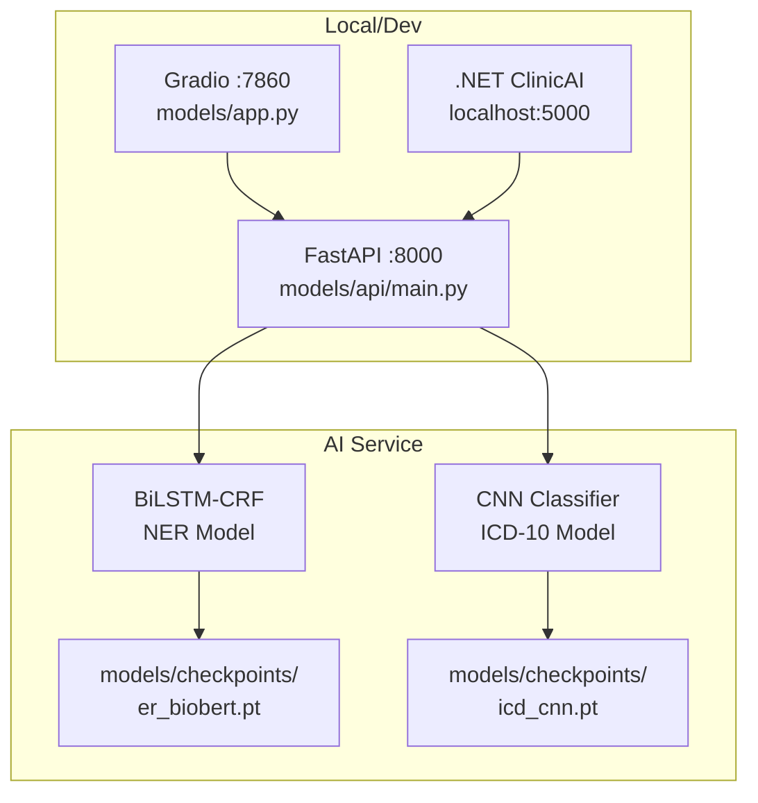

---

## 10. Team Responsibilities

| Team | Responsibility |
|---|---|
| **AI/ML (Ahmed Adel)** | Phases 1–8: data, preprocessing, models, training, API, Gradio UI |
| **Backend (.NET team)** | Phase 9: `AiService.cs` integration, database, API controllers |
| **Frontend / Mobile team** | Phase 9: display NER highlights and ICD results in dashboard |
| **All** | Phase 10: documentation, testing, final report |

---

## Quick Commands Reference

```bash
# Install AI dependencies
pip install -r models/requirements.txt

# Run model playground demo
uv run models/clinical_nlp_workspace.py

# Download NER dataset
uv run python models/data/download_bc5cdr.py

# Train NER — Config A (GloVe)
uv run python models/train_ner.py --embedding glove

# Train NER — Config B (BioBERT)
uv run python models/train_ner.py --embedding biobert

# Train ICD-10 classifier
uv run python models/train_classifier.py

# Generate evaluation report
uv run python models/evaluate.py

# Start FastAPI service
uvicorn models.api.main:app --reload --port 8000

# Launch Gradio UI
uv run python models/app.py
```

---

---

# PART B — Medical Image Diagnosis (Chest X-ray)

---

## 8. Image Diagnosis Overview

### Problem Statement (تعريف المشكلة)

Chest X-ray interpretation is **time-consuming** and **expert-dependent**. This system uses **deep learning CNNs** to automatically detect common pulmonary and cardiac abnormalities from chest X-ray images, reducing radiologist workload and surfacing critical findings faster.

### What We Are Building

| Sub-Task | Input | Output | Model |
|---|---|---|---|
| **X-ray Classification** | Chest X-ray image (JPEG/PNG) | Detected disease + confidence score | DenseNet-121 / ResNet-50 |
| **Multi-label Detection** | Single X-ray | Multiple co-occurring diseases | Sigmoid multi-label head |
| **Gradio UI (Image)** | Uploaded X-ray | Highlighted regions + disease list | Gradio image interface |
| **API Endpoint** | X-ray image bytes | JSON prediction + confidence | FastAPI `/predict/xray` |

### Targeted Diseases & Expected Accuracies

| Disease | Arabic Name | Medical Description | Expected Accuracy | Doctor Difficulty |
|---|---|---|---|---|
| **Pneumonia** | الالتهاب الرئوي | Infection in the lung's air sacs | 88–94% | 80% |
| **Pleural Effusion** | الانصباب الجنبي | Fluid accumulation around lungs | 90–95% | 85% |
| **Atelectasis** | انخماص الرئة | Partial/complete lung collapse | 82–90% | 70% |
| **Cardiomegaly** | تضخم القلب | Abnormal heart enlargement | 92–96% | 90% |
| **Lung Nodule/Mass** | عقدة/كتلة رئوية | Small growth in lung tissue | 80–88% | 65% |
| **Fibrosis** | تليف الرئة | Lung tissue scarring | 78–85% | 60% |
| **Tuberculosis** | السل | Bacterial lung infection (TB) | 90–95% | 85% |

---

## 9. Image Pipeline Architecture

```mermaid
flowchart LR
    A["🖼️ Input X-ray Image\n(JPEG / PNG / DICOM)"] --> B

    subgraph PREPROCESS["🔧 Image Preprocessing"]
        B["Load & Decode\n(PIL / OpenCV)"] --> C
        C["Resize to 224×224\nor 256×256"] --> D
        D["Normalize Pixel Values\n(mean=[0.485,0.456,0.406]\nstd=[0.229,0.224,0.225])"] --> E
        E["Convert to Tensor\n(3 × H × W)"]
    end

    E --> F

    subgraph AUGMENT["🔀 Data Augmentation (Train only)"]
        F["Random Horizontal Flip"] --> G
        G["Random Rotation ±10°"] --> H
        H["Random Brightness\n& Contrast Jitter"] --> I
        I["Augmented Tensor\n(3 × 224 × 224)"]
    end

    I --> J

    subgraph MODEL["🧠 CNN Model Inference"]
        J["Pre-trained Backbone\n(DenseNet-121 or ResNet-50)\nImageNet weights → fine-tuned"] --> K
        K["Feature Maps\n(batch × 1024 channels)"] --> L
        L["Global Average Pooling\n→ 1024-dim feature vector"] --> M
        M["Dropout (p=0.5)"] --> N
        N["Fully Connected Layer\n(1024 → num_classes)"] --> O
        O["Sigmoid Activation\n(multi-label output)"]
    end

    O --> P["🏷️ Predictions JSON\n{Pneumonia: 0.87,\nCardiomegaly: 0.12,\nAtelectasis: 0.54}"]
```

---

## 10. Image Model Architecture Diagrams

### 10A. DenseNet-121 Fine-Tuned Architecture (Primary)

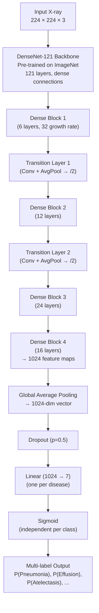

### 10B. ResNet-50 Alternative Architecture

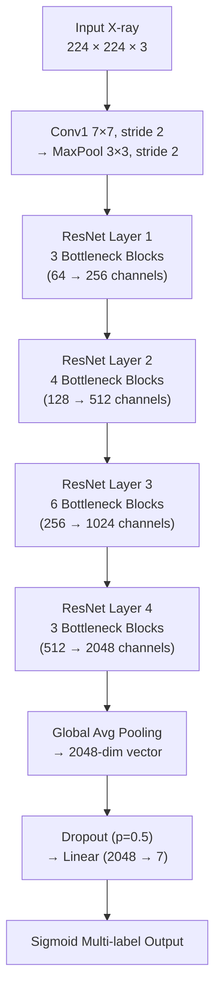

### 10C. Model Comparison Plan

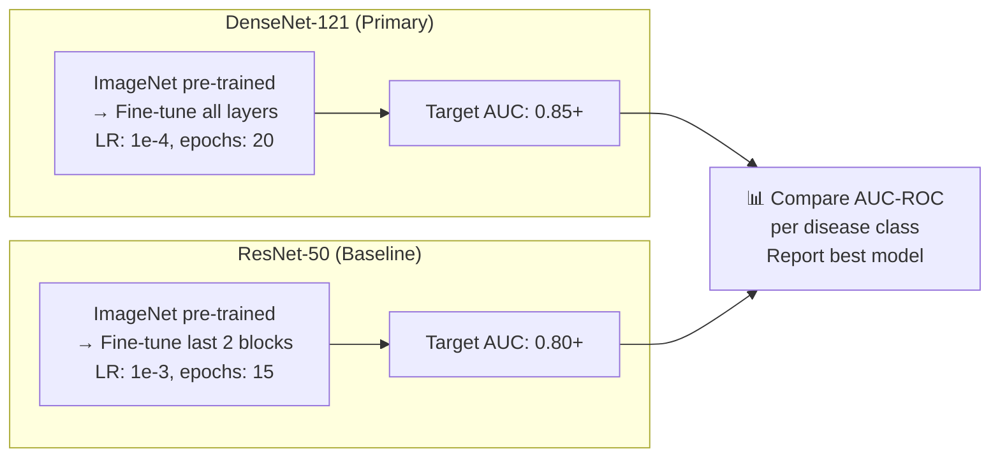

### 10D. Transfer Learning Strategy

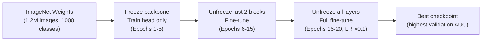

---

## 11. Image Data Flow

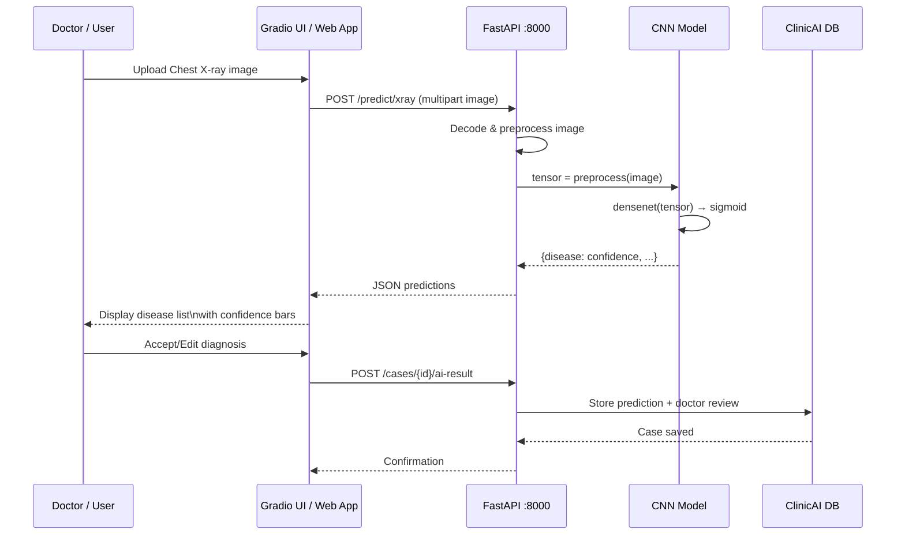

---

## 12. Image Phase-by-Phase Plan

### 🔲 Image Phase 1 — Dataset Collection

**Datasets to use:**

| Dataset | Size | Classes | Access |
|---|---|---|---|
| **NIH ChestX-ray14** | 112,120 images | 14 disease labels | Public (NIH) |
| **CheXpert** | 224,316 images | 14 labels + uncertainty | Public (Stanford) |
| **RSNA Pneumonia** | 30,000 images | Pneumonia only | Public (Kaggle) |
| **Montgomery/Shenzhen** | ~800 images | TB detection | Public (NIH) |

| Step | Action | File |
|---|---|---|
| I-1.1 | Download NIH ChestX-ray14 dataset | `models/image/data/download_chestxray.py` |
| I-1.2 | Split into train/val/test (70/15/15) | `models/image/data/split_dataset.py` |
| I-1.3 | EDA: class distribution, image quality | `models/image/data/explore_images.ipynb` |
| I-1.4 | Handle class imbalance (compute pos_weight) | `models/image/data/explore_images.ipynb` |

---

### 🔲 Image Phase 2 — Preprocessing & Augmentation

| Step | Action | File |
|---|---|---|
| I-2.1 | Resize all images to 224×224 | `models/image/src/preprocess.py` |
| I-2.2 | Normalize with ImageNet mean/std | `models/image/src/preprocess.py` |
| I-2.3 | Apply train augmentation (flip, rotate, jitter) | `models/image/src/preprocess.py` |
| I-2.4 | Create PyTorch `Dataset` + `DataLoader` | `models/image/src/dataset.py` |

---

### 🔲 Image Phase 3 — Model Implementation

| Step | Action | File |
|---|---|---|
| I-3.1 | Build DenseNet-121 with custom multi-label head | `models/image/src/model_densenet.py` |
| I-3.2 | Build ResNet-50 baseline model | `models/image/src/model_resnet.py` |
| I-3.3 | Implement Binary Cross-Entropy loss with pos_weight | `models/image/src/losses.py` |

---

### 🔲 Image Phase 4 — Training

```bash
# Train DenseNet-121 (Primary)
uv run python models/image/train_xray.py --model densenet --epochs 20 --lr 1e-4

# Train ResNet-50 (Baseline)
uv run python models/image/train_xray.py --model resnet --epochs 15 --lr 1e-3
```

**Hyperparameters:**

| Parameter | DenseNet-121 | ResNet-50 |
|---|---|---|
| Learning Rate | 1e-4 (fine-tune) | 1e-3 (head) / 1e-4 (full) |
| Batch Size | 32 | 32 |
| Optimizer | AdamW | Adam |
| Loss | WeightedBCE | WeightedBCE |
| Epochs | 20 | 15 |
| Scheduler | CosineAnnealing | StepLR ×0.1 every 5 |

Files: `models/image/train_xray.py`

---

### 🔲 Image Phase 5 — Evaluation

```bash
uv run python models/image/evaluate_xray.py --output docs/xray_evaluation_report.md
```

**Metrics per disease class:**

| Metric | Purpose |
|---|---|
| **AUC-ROC** | Primary metric (area under ROC curve per class) |
| **Precision @ 0.5** | Fraction of flagged cases truly positive |
| **Recall @ 0.5** | Fraction of true cases caught |
| **F1 @ 0.5** | Harmonic mean P+R |
| **Mean AUC** | Single overall score across all 7 diseases |

---

### 🔲 Image Phase 6 — Grad-CAM Visualization

Add **Grad-CAM** heatmaps so doctors can see *which region* of the X-ray triggered the prediction — critical for clinical trust.

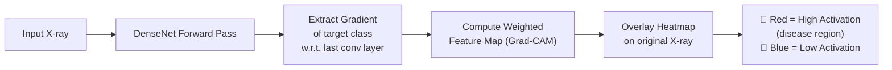

Files: `models/image/src/gradcam.py`

---

### 🔲 Image Phase 7 — FastAPI Endpoint

```python
# POST /predict/xray
# Input:  multipart/form-data image file
# Output: {
#   "predictions": [
#     {"disease": "Pneumonia", "confidence": 0.87, "threshold": 0.5, "detected": true},
#     {"disease": "Cardiomegaly", "confidence": 0.12, "threshold": 0.5, "detected": false}
#   ],
#   "gradcam_url": "/static/gradcam_result.png"
# }
```

Files: `models/api/main.py` (add `/predict/xray` route)

---

### 🔲 Image Phase 8 — Gradio UI (Image Tab)

```text
┌──────────────────────────────────────────────────────────────┐
│  X-ray Diagnosis Demo                                         │
│  ──────────────────────────────────────────────────────────  │
│  Upload X-ray:  [📁 Choose File]                             │
│                                                               │
│  ┌───────────────────┐  ┌────────────────────────────────┐  │
│  │                   │  │ 🔴 Detected Conditions:         │  │
│  │  [X-ray image     │  │  ✅ Pneumonia         87%      │  │
│  │   with Grad-CAM   │  │  ✅ Atelectasis       54%      │  │
│  │   heatmap overlay]│  │  ❌ Cardiomegaly      12%      │  │
│  │                   │  │  ❌ Effusion           8%      │  │
│  └───────────────────┘  └────────────────────────────────┘  │
│                    [Analyze X-ray]                            │
└──────────────────────────────────────────────────────────────┘
```

File: `models/image/app_xray.py` (combined into `models/app.py` with tabs)

---

### 🔲 Image Phase 9 — .NET Backend Integration

```csharp
// Web/ClinicAI/Services/AiService.cs
public async Task<XrayResult> AnalyzeXrayAsync(IFormFile xrayFile)
{
    using var form = new MultipartFormDataContent();
    form.Add(new StreamContent(xrayFile.OpenReadStream()), "file", xrayFile.FileName);
    var response = await _httpClient.PostAsync("http://localhost:8000/predict/xray", form);
    return await response.Content.ReadFromJsonAsync<XrayResult>();
}
```

---

### Updated Repository Structure (Full)

```text
DEPI-AI-ML-Project/
│
├── models/                            # 📁 All Python AI/ML code
│   ├── clinical_nlp_workspace.py      # NLP quick demo
│   ├── app.py                         # Combined Gradio UI (NLP + X-ray tabs)
│   │
│   ├── src/                           # 📁 NLP pipeline
│   │   ├── preprocess.py
│   │   ├── embeddings.py
│   │   ├── models.py
│   │   └── crf.py
│   │
│   ├── image/                         # 📁 X-ray image pipeline  ← NEW
│   │   ├── train_xray.py              # X-ray model training
│   │   ├── evaluate_xray.py           # AUC-ROC evaluation
│   │   ├── app_xray.py                # Gradio tab for X-ray
│   │   ├── src/
│   │   │   ├── preprocess.py          # Image resize + normalize
│   │   │   ├── dataset.py             # PyTorch Dataset class
│   │   │   ├── model_densenet.py      # DenseNet-121 model
│   │   │   ├── model_resnet.py        # ResNet-50 baseline
│   │   │   ├── losses.py              # Weighted BCE loss
│   │   │   └── gradcam.py             # Grad-CAM visualization
│   │   └── data/
│   │       ├── download_chestxray.py  # NIH dataset downloader
│   │       ├── split_dataset.py       # Train/val/test split
│   │       └── explore_images.ipynb   # EDA notebook
│   │
│   ├── api/                           # 📁 FastAPI (NLP + Image)
│   │   ├── main.py                    # /predict/ner, /predict/icd10, /predict/xray
│   │   └── schemas.py
│   │
│   └── checkpoints/                   # Saved weights
│       ├── ner_biobert.pt
│       ├── icd_cnn.pt
│       └── xray_densenet.pt           # ← NEW
```

---

## 13. Evaluation Strategy (Both Pipelines)

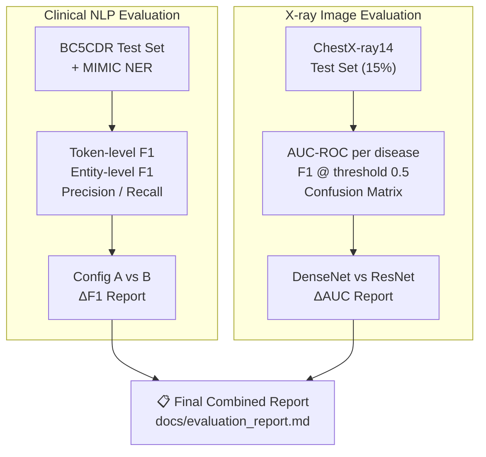

---

## 14. Deployment Architecture (Both Pipelines)

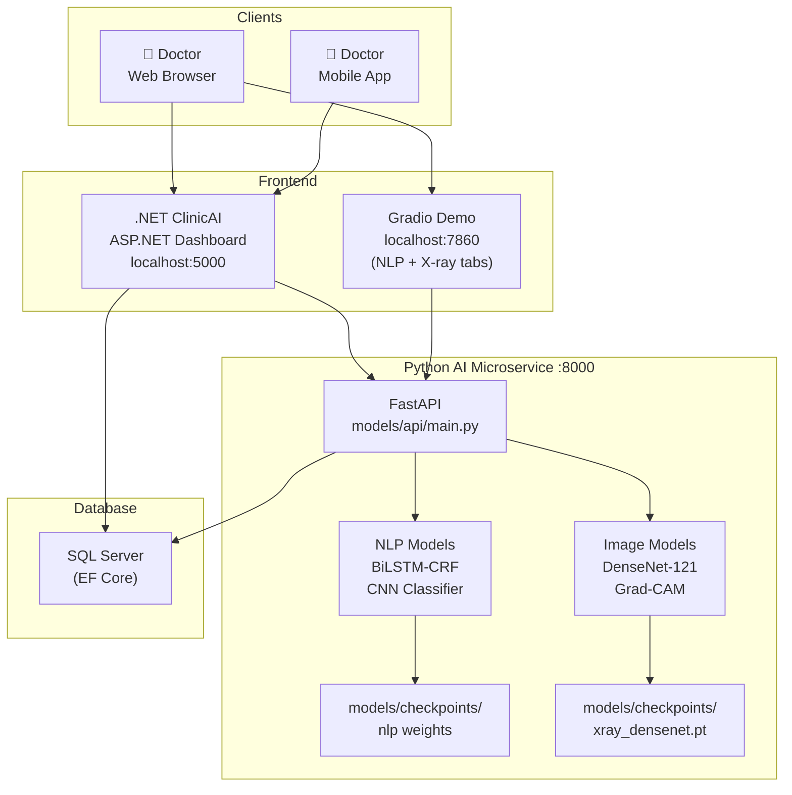

---

## 15. Team Responsibilities

| Team | NLP Responsibilities | Image Responsibilities |
|---|---|---|
| **AI/ML (Ahmed Adel)** | NLP phases 1–8: data, models, API, Gradio | Image phases 1–8: X-ray data, CNN, Grad-CAM, API |
| **Backend (.NET team)** | `AiService.cs` NLP integration | `AiService.cs` X-ray integration, patient case storage |
| **Frontend / Mobile** | Show entity highlights + ICD codes | Show X-ray upload UI + disease confidence bars |
| **All** | Documentation, final report, PR review | Documentation, final report, PR review |

---

## Quick Commands Reference (Full)

```bash
# ── NLP ──────────────────────────────────────────────────
# Install dependencies
pip install -r models/requirements.txt

# Run NLP playground demo
uv run python models/clinical_nlp_workspace.py

# Download NER dataset (BC5CDR)
uv run python models/data/download_bc5cdr.py

# Train NER Config A (GloVe)
uv run python models/train_ner.py --embedding glove --epochs 20

# Train NER Config B (BioBERT)
uv run python models/train_ner.py --embedding biobert --epochs 10

# Train ICD-10 CNN classifier
uv run python models/train_classifier.py --epochs 15

# Evaluate NLP models
uv run python models/evaluate.py --output docs/nlp_evaluation_report.md

# ── X-RAY IMAGE ──────────────────────────────────────────
# Download NIH ChestX-ray14 dataset
uv run python models/image/data/download_chestxray.py

# Train DenseNet-121 (Primary)
uv run python models/image/train_xray.py --model densenet --epochs 20

# Train ResNet-50 (Baseline)
uv run python models/image/train_xray.py --model resnet --epochs 15

# Evaluate X-ray models
uv run python models/image/evaluate_xray.py --output docs/xray_evaluation_report.md

# ── SHARED ───────────────────────────────────────────────
# Start FastAPI service (NLP + X-ray endpoints)
uvicorn models.api.main:app --reload --port 8000

# Launch combined Gradio UI
uv run python models/app.py
```
