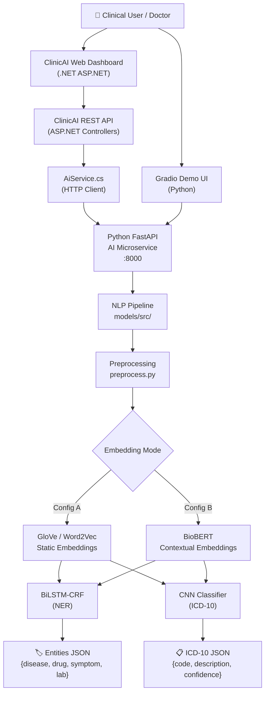
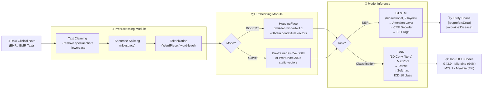
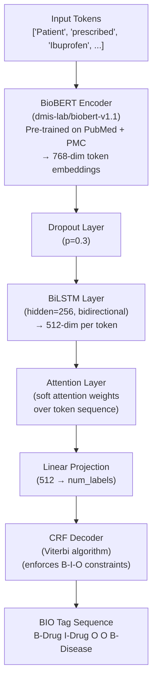
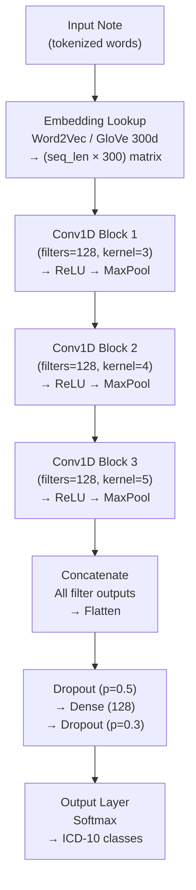
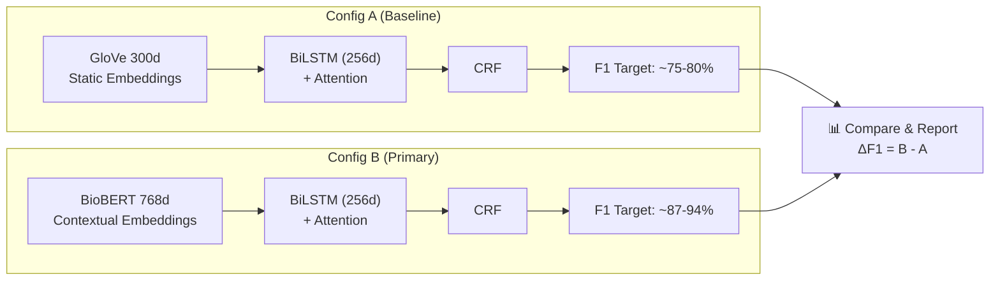
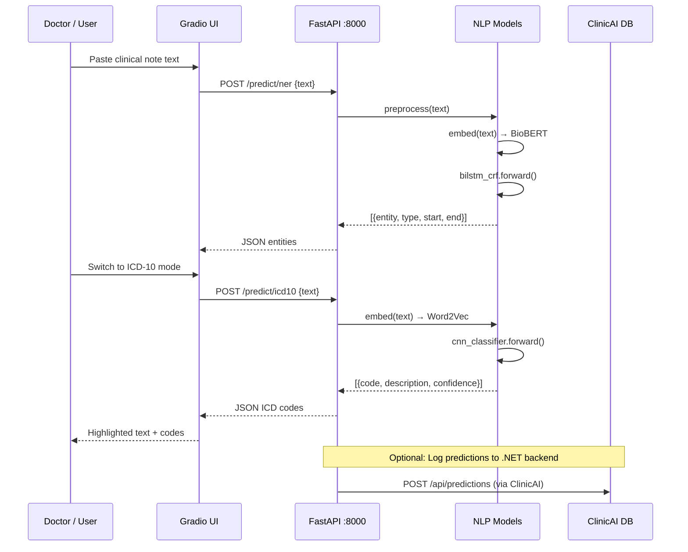
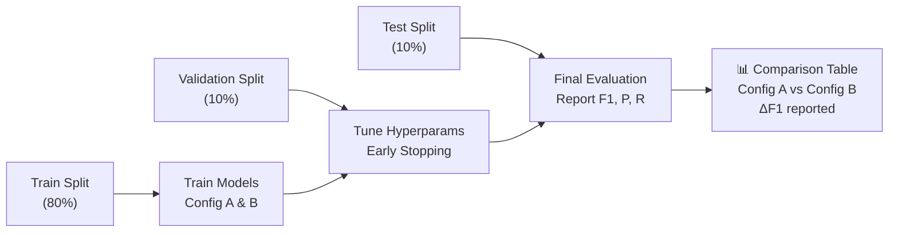
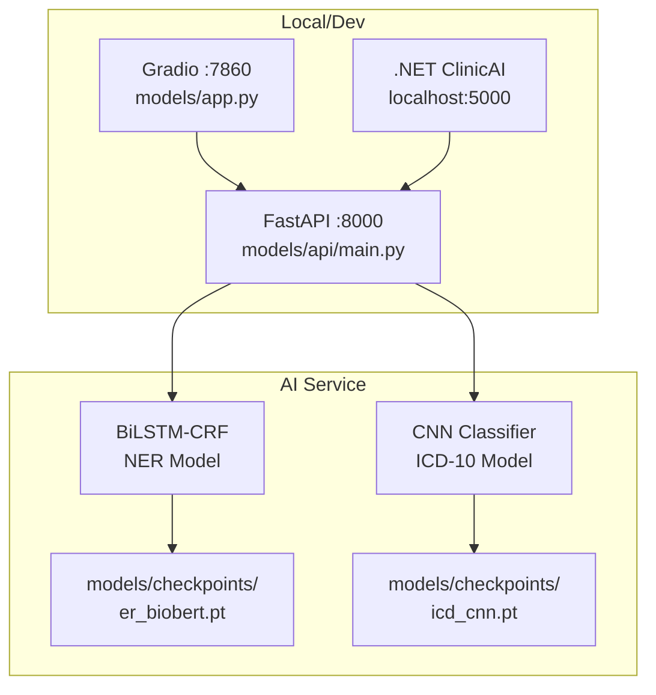

# Clinical NLP Project — Full Implementation Plan (A to Z)

> **Branch**: `ahmed-adel-tasks` | **Date**: 2026-06-23
> **Team**: AI/ML Group (DEPI Program)

---

## Table of Contents

1. [Project Overview](#1-project-overview)
2. [System Architecture (High-Level)](#2-system-architecture-high-level)
3. [NLP Pipeline Architecture](#3-nlp-pipeline-architecture)
4. [Model Architecture Diagrams](#4-model-architecture-diagrams)
5. [Data Flow](#5-data-flow)
6. [Repository Structure](#6-repository-structure)
7. [Phase-by-Phase Plan](#7-phase-by-phase-plan)
8. [Evaluation Strategy](#8-evaluation-strategy)
9. [Deployment Architecture](#9-deployment-architecture)
10. [Team Responsibilities](#10-team-responsibilities)

---

## 1. Project Overview

### What We Are Building

An AI-powered **clinical decision-support system** that:

| Sub-Task | Input | Output | Model |
|---|---|---|---|
| **NER** | Raw clinical note | Tagged entities (Disease / Drug / Symptom / Lab) | BioBERT + BiLSTM + CRF |
| **ICD-10 Classification** | Clinical note | Top-3 ICD-10 codes + confidence | CNN + Word2Vec |
| **Summarization** | Discharge note | Chief complaint, findings, plan | Extractive summary |
| **Gradio UI** | Clinical note text | Visual entity highlights + predictions | Gradio interface |

### Key Decisions

- **Primary NER model**: BioBERT + BiLSTM + CRF (F1: ~87–94%)
- **Secondary Classifier**: CNN + Word2Vec (F1: up to 0.98 ICD dept.)
- **Embeddings compared**: BioBERT (contextual) vs GloVe/Word2Vec (static)
- **Deployment**: Gradio demo + FastAPI bridge → .NET ClinicAI backend

---

## 2. System Architecture (High-Level)



---

## 3. NLP Pipeline Architecture



---

## 4. Model Architecture Diagrams

### 4A. BioBERT + BiLSTM + CRF (NER Model)



### 4B. CNN + Word2Vec (ICD-10 Classifier)



### 4C. Two-Config Experimental Comparison



---

## 5. Data Flow



---

## 6. Repository Structure

```text
DEPI-AI-ML-Project/
│
├── README.md                          # Project overview for everyone
├── plan.md                            # Literature review & model comparison
├── GEMINI.md                          # AI assistant instructions
│
├── docs/                              # 📁 Project documentation
│   ├── FULL_PLAN.md                   # ← This file
│   ├── Clinical Note + Medical Image Diagnosis Support.docx
│   └── تعريف المشكلة وتحديد الأمراض المستهدفة.docx
│
├── models/                            # 📁 All Python AI/ML code
│   ├── clinical_nlp_workspace.py      # Quick demo / playground
│   ├── requirements.txt               # Python deps (torch, transformers, gradio…)
│   ├── app.py                         # Gradio UI launcher
│   ├── train_ner.py                   # NER training script (Config A & B)
│   ├── train_classifier.py            # ICD-10 CNN training script
│   ├── evaluate.py                    # Evaluation report generator
│   │
│   ├── data/                          # 📁 Dataset utilities
│   │   ├── download_bc5cdr.py         # Download BC5CDR NER dataset
│   │   └── explore_dataset.ipynb      # EDA notebook
│   │
│   ├── src/                           # 📁 Core pipeline modules
│   │   ├── preprocess.py              # Text cleaning + tokenization
│   │   ├── embeddings.py              # BioBERT & GloVe loaders
│   │   ├── models.py                  # BiLSTM-CRF + CNN model classes
│   │   └── crf.py                     # CRF layer (Viterbi decoder)
│   │
│   ├── api/                           # 📁 FastAPI microservice
│   │   ├── main.py                    # /predict/ner, /predict/icd10 endpoints
│   │   └── schemas.py                 # Pydantic request/response models
│   │
│   ├── checkpoints/                   # 📁 Saved model weights (.pt files)
│   └── tests/                         # 📁 Unit tests
│       ├── test_preprocess.py
│       └── test_models.py
│
├── Web/                               # 📁 .NET ClinicAI backend
│   └── ClinicAI/
│       ├── Services/AiService.cs      # Calls Python FastAPI from .NET
│       ├── Controllers/               # REST API controllers
│       ├── Models/                    # EF Core data models
│       └── ...                        # Full ASP.NET project
│
└── specs/                             # 📁 Spec-Driven Development docs
    └── 001-clinical-nlp-pipeline/
        ├── spec.md
        ├── plan.md
        ├── tasks.md
        └── checklists/requirements.md
```

---

## 7. Phase-by-Phase Plan

### ✅ Phase 0 — Setup (Done)

- [x] Create `ahmed-adel-tasks` branch
- [x] Initialize Spec Kit (constitution, spec, tasks)
- [x] Create `models/` directory with workspace file
- [x] Update `README.md` with project description

---

### 🔲 Phase 1 — Data Collection & Exploration

**Goal**: Get the training data ready for NER and classification.

| Step | Action | File |
|---|---|---|
| 1.1 | Download BC5CDR dataset (chemical/disease NER) | `models/data/download_bc5cdr.py` |
| 1.2 | Download NCBI-disease dataset (alternative NER) | `models/data/download_bc5cdr.py` |
| 1.3 | Perform EDA: label distribution, sentence lengths, entity frequencies | `models/data/explore_dataset.ipynb` |
| 1.4 | Register for MIMIC-III/IV on PhysioNet (for ICD data) | External |

**Datasets**:

| Dataset | Task | Source | Access |
|---|---|---|---|
| BC5CDR | NER (chemical + disease) | PubMed Central | Public |
| NCBI-disease | NER (disease only) | NCBI | Public |
| MIMIC-III | NER + ICD-10 coding | PhysioNet | Credentialed |
| GloVe 6B / 840B | Static embeddings | Stanford NLP | Public |
| BioBERT v1.1 | Contextual embeddings | HuggingFace Hub | Public |

---

### 🔲 Phase 2 — Preprocessing

**Goal**: Convert raw text into model-ready tensors with correct BIO labels.

```text
Raw text → Clean → Sentence split → Tokenize → Align BIO labels → Batch
```

| Step | Action | File |
|---|---|---|
| 2.1 | Text cleaning (lowercase, remove special chars, expand abbreviations) | `models/src/preprocess.py` |
| 2.2 | Sentence tokenization using `nltk.sent_tokenize` | `models/src/preprocess.py` |
| 2.3 | BIO label alignment with subword tokenization (for BioBERT) | `models/src/preprocess.py` |
| 2.4 | Create `DataLoader` batches with padding and masking | `models/src/preprocess.py` |
| 2.5 | Write unit tests | `models/tests/test_preprocess.py` |

---

### 🔲 Phase 3 — Embeddings

**Goal**: Build both embedding configurations.

| Config | Library | Model | Dimension |
|---|---|---|---|
| **A (Baseline)** | `gensim` / `numpy` | GloVe 6B.300d or Word2Vec | 300 |
| **B (Primary)** | `transformers` | `dmis-lab/biobert-v1.1` | 768 |

Files: `models/src/embeddings.py`

---

### 🔲 Phase 4 — Model Implementation

**Goal**: Build the two model classes.

| Model | Architecture | File |
|---|---|---|
| `BiLSTM_CRF` | BioBERT/GloVe → BiLSTM (256d) → Attention → CRF | `models/src/models.py` + `models/src/crf.py` |
| `CNNClassifier` | Word2Vec → Conv1D (3 sizes) → MaxPool → Dense → Softmax | `models/src/models.py` |

---

### 🔲 Phase 5 — Training

**Goal**: Train both configurations and log results.

```bash
# Config A: GloVe + BiLSTM + CRF
uv run python models/train_ner.py --embedding glove --epochs 20

# Config B: BioBERT + BiLSTM + CRF
uv run python models/train_ner.py --embedding biobert --epochs 10

# ICD-10 classifier
uv run python models/train_classifier.py --epochs 15
```

Files: `models/train_ner.py`, `models/train_classifier.py`

**Hyperparameters**:

| Parameter | NER | Classifier |
|---|---|---|
| Learning Rate | 2e-5 (BioBERT) / 1e-3 (GloVe) | 1e-3 |
| Batch Size | 16 | 32 |
| Hidden Dim | 256 | — |
| Dropout | 0.3 | 0.5 |
| Optimizer | AdamW | Adam |

---

### 🔲 Phase 6 — Evaluation

**Goal**: Generate a comparison report — Config A vs Config B.

```bash
uv run python models/evaluate.py --output docs/evaluation_report.md
```

**Metrics tracked**:

| Metric | NER | ICD Classifier |
|---|---|---|
| Entity-level F1 | ✅ | — |
| Token-level F1 | ✅ | — |
| Precision | ✅ | ✅ |
| Recall | ✅ | ✅ |
| Accuracy | — | ✅ |

---

### 🔲 Phase 7 — FastAPI Microservice

**Goal**: Wrap models in a REST API callable from the .NET backend.

```python
# POST /predict/ner
# Input:  { "text": "Patient prescribed Ibuprofen..." }
# Output: { "entities": [{ "entity": "Ibuprofen", "type": "Drug", "start": 19 }] }

# POST /predict/icd10
# Input:  { "text": "Chest pain, shortness of breath..." }
# Output: { "predictions": [{ "code": "I21.9", "label": "Acute MI", "confidence": 0.87 }] }
```

Files: `models/api/main.py`, `models/api/schemas.py`

---

### 🔲 Phase 8 — Gradio UI

**Goal**: Interactive demo for clinical staff and project demonstrations.

```text
┌─────────────────────────────────────────────────────────┐
│  Clinical NLP Demo                                       │
│  ─────────────────────────────────────────────────────  │
│  Mode: [● NER]  [○ ICD-10]                              │
│                                                          │
│  Clinical Note:                                          │
│  ┌─────────────────────────────────────────────────┐   │
│  │ Patient prescribed Ibuprofen for severe migraine │   │
│  └─────────────────────────────────────────────────┘   │
│                         [Analyze]                        │
│                                                          │
│  Results:                                                │
│  Patient prescribed [Ibuprofen: Drug] for severe        │
│  [migraine: Disease]                                     │
│                                                          │
│  Top Diagnosis: G43.9 — Migraine (94% confidence)       │
└─────────────────────────────────────────────────────────┘
```

File: `models/app.py`

---

### 🔲 Phase 9 — .NET Backend Integration

**Goal**: `AiService.cs` calls Python FastAPI and surfaces predictions.

```csharp
// Web/ClinicAI/Services/AiService.cs
public async Task<NerResult> AnalyzeNoteAsync(string clinicalNote)
{
    var payload = new { text = clinicalNote };
    var response = await _httpClient.PostAsJsonAsync("http://localhost:8000/predict/ner", payload);
    return await response.Content.ReadFromJsonAsync<NerResult>();
}
```

---

### 🔲 Phase 10 — Documentation & Final Report

- Update `docs/FULL_PLAN.md` with evaluation results
- Create `docs/evaluation_report.md` with Config A vs B comparison table
- Update `specs/001-clinical-nlp-pipeline/tasks.md` to mark all phases complete
- Push to GitHub and open a Pull Request from `ahmed-adel-tasks` → `main`

---

## 8. Evaluation Strategy



---

## 9. Deployment Architecture



---

## 10. Team Responsibilities

| Team | Responsibility |
|---|---|
| **AI/ML (Ahmed Adel)** | Phases 1–8: data, preprocessing, models, training, API, Gradio UI |
| **Backend (.NET team)** | Phase 9: `AiService.cs` integration, database, API controllers |
| **Frontend / Mobile team** | Phase 9: display NER highlights and ICD results in dashboard |
| **All** | Phase 10: documentation, testing, final report |

---

## Quick Commands Reference

```bash
# Install AI dependencies
pip install -r models/requirements.txt

# Run model playground demo
uv run models/clinical_nlp_workspace.py

# Download NER dataset
uv run python models/data/download_bc5cdr.py

# Train NER — Config A (GloVe)
uv run python models/train_ner.py --embedding glove

# Train NER — Config B (BioBERT)
uv run python models/train_ner.py --embedding biobert

# Train ICD-10 classifier
uv run python models/train_classifier.py

# Generate evaluation report
uv run python models/evaluate.py

# Start FastAPI service
uvicorn models.api.main:app --reload --port 8000

# Launch Gradio UI
uv run python models/app.py
```
